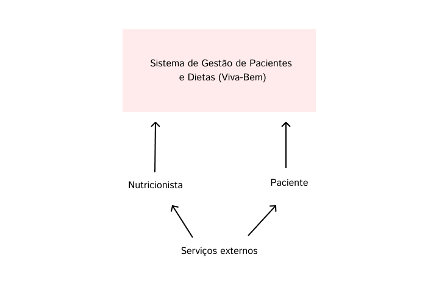
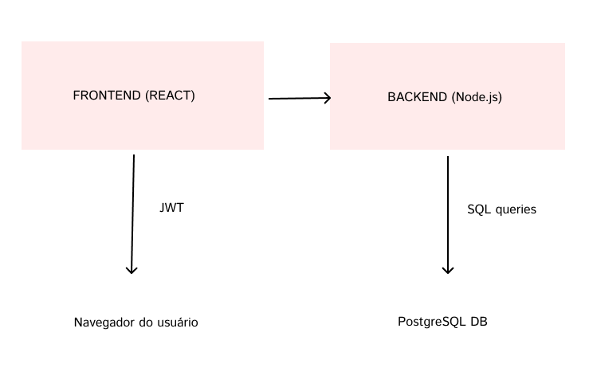
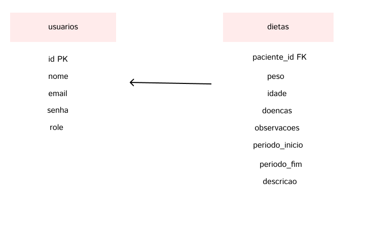

# desenvolvimento-web-2025-2

# Viva Bem- Organização Alimentar

## 1) Problema
Os nutricionistas, em hospitais e clínicas, tem dificuldade em manter os pacientes conectados com o tratamento. Isso causa um grande retrocesso no tratamento do paciente e dificulta a organizaçãodo nutricionista com a falta de retorno do paciente.
No início, o foco será nutricionistas que possuam clínicas ou trabalhem nelas, com o objetivo de simplificar a rotina destes funcionários e consequentemente melhorar a vida dos pacientes.

## 2) Atores e Decisores (quem usa/quem decide)
Usuários principais: Nutricionistas e seus respectivos pacientes.
Decisores/Apoiadores: Nutricionistas.

## 3) Caso de uso
Todos: Logar/Deslogar do sistema; Manter dados cadastrais; Visitar o plano alimentar; Ver histórico de evolução.
Nutricionista: Criar o plano alimentar do paciente; Organizar as consultas; Verificar o chat para receber os feedbacks.
Paciente: Conversar com o nutricionista pelo chat; Marcar uma nova consulta; Registrar as refeições, sintomas, peso e medidas; Receber notificações com a hora de comer, tomar água e próxima consulta.

## 4) Limites e suposições
Limites: A entrega final será realizada no fim da disciplina; O sistema deverá rodar no navegador; Deve ter todas as funcionalidades corretas; Não será utilizado serviços pagos.
Suposições: Internet no laboratório; O navegador deve estar atualizado; Ter acesso ao GitHub; Ter no mínimo 10 minutos para teste rápido.
Plano B: Se não tiver internet-> rodar localmente e testar as funcionalidades.

## 5) Hipóteses + validação
H-Valor: Se o nutricionista conseguir organizar com mais facilidade a rotina alimentar do paciente, então conseguirá trazer uma melhora para o seu trabalho e para a vida do paciente.  
Validação: teste com pelo menos 3 nutricionistas; alvo: sucesso se conseguirem criar a dieta para o paciente.

H-Viabilidade: Com app no navegador(HTML/CSS/JS + armazenamento local), criar, editar e publicar uma dieta leva até 1 segundo na maioria das vezes.  
Validação: medir no protótipo com 30 ações; meta: pelo menos 27 de 30 ações (9/10) em 1s ou menos.

## 6) Fluxo principal e primeira fatia
1) O usuário faz login → 2) Clica em criar dieta → 3) O sistema salva o que foi criado → 4) O paciente recebe a dieta que fica exposta em seu dashboard.

**Primeira fatia vertical (escopo mínimo):**  
Inclui: Login básico, criação de dieta para o paciente, salvar as informações, enviar para o paciente a dieta.  
Critérios de aceite:
- criar -> vai aparecer uma página para criação da dieta;
- encerrar -> tudo que foi escrito será apagado e sai da tela.

# 7) System Design
# 7.1) C4 Context Diagram

Este diagrama de contexto mostra o sistema como um bloco central, interagindo com os usuários (Nutricionista e Paciente) e com sistemas externos. O backend se comunica com o banco de dados para persistência de dados e com serviços adicionais (e-mail, notificações) caso necessário.
# 7.2) C4 Containers (Nível 2)

O diagrama de containers detalha os componentes internos do sistema, mostrando como o frontend se comunica com o backend via HTTP/HTTPS e como o backend interage com o banco de dados. JWT é usado para autenticação e autorização, garantindo que apenas usuários válidos acessem seus dados.
# 7.3) Modelo de Dados (ERD)

O diagrama de entidade-relacionamento ilustra a estrutura do banco de dados, destacando a relação de um para muitos entre pacientes e suas dietas. Cada paciente pode ter múltiplas dietas, e todas as relações são mantidas com integridade referencial.
# 7.4) Diagramas de Sequência de um fluxo crítico
# Sequência 1: Login do usuário:
Este diagrama mostra o fluxo de login, incluindo autenticação e retorno do JWT, garantindo que apenas usuários válidos acessem o sistema.
# Sequência 2: CRUD de Dietas (ex.: criar dieta):
Este diagrama ilustra o fluxo de criação de uma dieta, mostrando a sequência de requisições entre frontend, backend e banco de dados, e como o paciente recebe o plano alimentar no seu painel.
